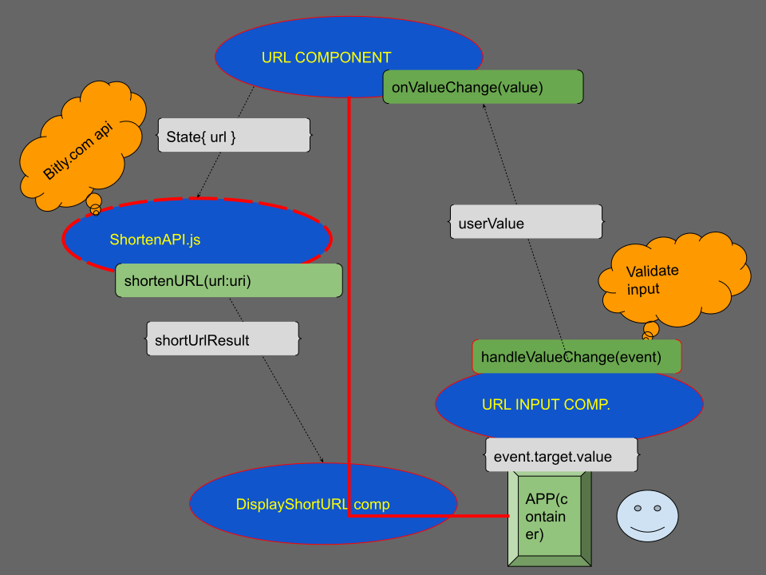

# URL Shortner
Shortens URLs using the bitly.com API.

### only accepts URLs as
```
http://www.yourdomain.com/
```
or
```
https://www.yourdomain.com/
```

# DevLog
### Hooks vs ComponentDidMount
## --
[Hooks are functions that let you “hook into” React features from function components.](https://reactjs.org/docs/hooks-state.html)
## --
Used Hook function components to
- avoid using classes. Short hand way to call api vs componentDidMount, componentDidUpdate, and componentWillUnmount
- avoid having to duplicate the code between the two lifecycle methods componentDidMount, and componentDidUpdate
- creates a state variable that does not disapear.
- state does not have to be an object.
- this.state and this.setState all in one
- NO MORE this!
# Components
## Container
Holds the other components within the app.

## URLComponent
Handles users input, makes call to bitly api, displays the shorten url.

class implementation


7cd5e57bdf8338be3ff371918fb77aefcbdbec27