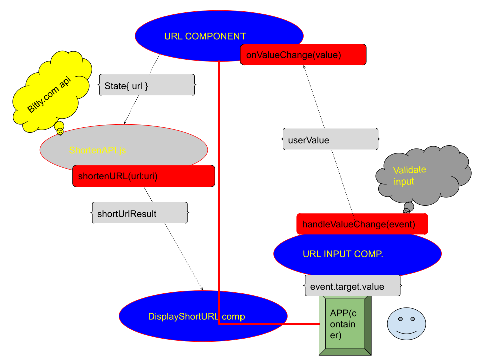

# URL Shortner
Shortens URLs using the bitly.com API.

### only accepts URLs as
```
http://www.yourdomain.com/
```
or
```
https://www.yourdomain.com/
```

# DevLog
### Hooks vs ComponentDidMount
Though the state of the main component URL component is a single state I went with hooks due to avoiding issues with hot reloading and writing
three methods to handle side effects and clean up.
# Components
## Container
Holds the other components within the app.

## URLComponent
Handles users input, makes call to bitly api, displays the shorten url.


